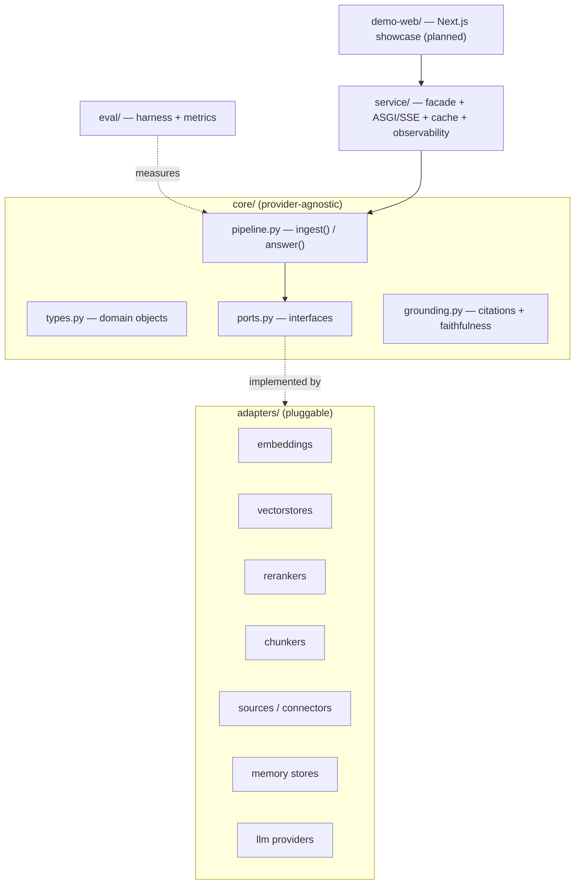
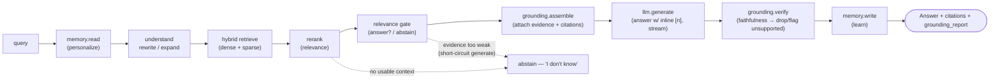

# Architecture

> Provider-agnostic core, pluggable everything-that-varies, measurement built in from day one.

---

## 1. Principles

1. **Ports & adapters (hexagonal).** The core orchestration logic knows nothing about Voyage, OpenAI,
   pgvector, or PDFs. Everything that varies is a **port** (an interface); a concrete provider is an
   **adapter**. Customization = swapping/configuring adapters, never forking the core.
2. **Eval-first.** The evaluation module is wired on day one, not bolted on. If you can't measure a
   change, you don't ship it. → [`evaluation.md`](evaluation.md)
3. **Config-as-customization.** A typed (pydantic) config schema is the client-facing surface. A client
   need that can't be expressed as config or a plugin is a signal to add a new **port**, not a fork.
4. **Grounding and memory are pipeline stages, not add-ons.** They sit in the main `answer()` path.

## 2. Component view



## 3. Core domain types (`core/types.py`)

`Document` · `Chunk` · `EmbeddedChunk` · `Query` · `Retrieval` (chunk + score + source span) ·
`Evidence` (verbatim quote + offset + doc ref) · `GroundedContext` (assembled, cited) · `Citation` ·
`Answer` (text + citations + grounding_report) · `GroundingReport` (per-claim support state) ·
`MemoryItem` (→ [`memory.md`](memory.md)) · `EvalResult`.

## 4. Ports — the plugin boundaries (`core/ports.py`)

`Protocol`s (structural typing — adapters need no inheritance):

| Port | Responsibility | Example adapters |
|---|---|---|
| `EmbeddingProvider` | text → vectors (`document` vs `query` input types) | voyage · openai · local-bge · mock |
| `VectorStore` | upsert · filtered similarity search · content-hash diff (`chunk_ids`/`delete`) for incremental re-index, per tenant | pgvector · inmemory |
| `Reranker` | re-order candidates by query relevance | voyage-rerank · cross-encoder · noop |
| `Chunker` | document → structure-aware chunks | structural (page/section) · fixed-window |
| `DocumentSource` | fetch + extract raw documents, with a freshness timestamp | filesystem · inmemory · pdf · sec-edgar · web · s3 |
| `MemoryStore` | per-user read/write/compaction | pg-memory · file-memory |
| `MemoryExtractor` | turn → durable per-user memories (the write policy) | rule-based ($0) · llm |
| `LLMProvider` | grounded generation (streaming) | anthropic · openai |
| `EntailmentJudge` | per-claim: does cited evidence support it? | substring · token-overlap · llm-judge |
| `RelevanceGate` | answer-vs-abstain on the retrieved evidence (proactive refusal) | threshold · anthropic · openai (local/hosted) · cascade |
| `AnswerCache` | serve a repeat answer if its grounding is still intact (latency, gated by content-hash) | grounding-gated (in-memory) · redis/edge |
| `Evaluator` | score a run against a dataset | retrieval · grounding · answer |

## 5. The two pipelines (`core/pipeline.py`)

**`ingest(source, tenant)`** — `DocumentSource.fetch → extract → Chunker.chunk → diff → EmbeddingProvider.embed
→ VectorStore.upsert [→ prune]`, recording metadata + a freshness timestamp. The diff is on the content-hash
ID (ADR-0011): only changed chunks are embedded, and `prune=True` deletes chunks the source dropped, so
re-index is incremental and leaves no stale content (ADR-0023). That freshness timestamp is carried
`Document → Chunk → Retrieval`, so the age of an answer's evidence is visible on the `Answer`; staleness is
judged against an explicit `now` (`core/freshness.py`), never the wall clock, keeping eval deterministic (ADR-0024).

**`answer(query, tenant, user)`** — grounding, relevance, and memory are first-class. When a query
carries a `user_id`, `memory.read` injects the user's *relevant* memories (gated by overlap) as
labelled `memory/<turn>` evidence in the same grounded channel as the corpus — so a personal fact is
used by the model yet still verified by grounding (never invented), and personalization works at $0.
`memory.write` then learns durable facts from the turn via a `MemoryExtractor`, on every exit path
including abstain (ADR-0026):



## 6. How applications connect (the productizing layer, `service/`)

One core, one facade, many transports (Phase 5 — [`productizing.md`](productizing.md), ADR-0031).
`RaCoreService` (`service/core.py`) is a transport-agnostic object over the async pipeline: it maps a
wire request onto the core objects, drives `Pipeline`, and returns the rich core result. It adds **no**
engine logic — only product-surface concern. Two ways to reach it:

- **In-process import** — `RaCoreService` (or the raw `Pipeline`) as a Python object; lowest latency.
  How any Python app embeds the engine.
- **HTTP service** (`service/asgi.py`) — a **dependency-free ASGI app**: `GET /health`, `POST /ingest`,
  `POST /answer` (SSE streaming), `GET/POST /memory`. No web framework; any ASGI server runs it. For
  non-Python apps or process isolation.

Cross-cutting product concerns live at this layer, not in the core: **grounding-gated caching**
(`AnswerCache`, the latency lever, ADR-0032) and **per-request observability** (a `ServiceEvent` per
call to a pluggable `Observer`, ADR-0033).

**Multi-tenancy:** a `tenant_id` at the boundary namespaces the vector store and the memory store, so
one deployment serves many clients without co-mingling data. Per-user memory is keyed `(tenant, user)`.
The facade enforces this boundary and fails closed; the service tests prove isolation through the HTTP
round-trip.

## 7. Folder layout

```
src/racore/
  core/      types.py · ports.py · pipeline.py · grounding.py · freshness.py · ids.py
  adapters/  embeddings · vectorstores · rerankers · chunkers · sources · memory ·
             memory_extract · judges · relevance · llm · cache       # one module per port family
  eval/      harness.py · metrics.py · datasets.py · pricing.py · memory.py · __main__.py
  service/   core.py (facade) · asgi.py (HTTP/SSE) · observability.py · types.py
tests/       one module per behaviour, mirroring the package
config/      pydantic schema — the typed customization surface (planned)
demo-web/    Next.js: chat + click-to-source citations + memory panel (planned)
```

## 8. Tech choices (see [`decisions.md`](decisions.md) for the why)

Python 3.12 core, **zero runtime dependencies** · frozen-dataclass domain + wire types (a pydantic
config schema is the planned typed surface) · a **dependency-free ASGI** HTTP app — no web framework,
runs under any ASGI server (ADR-0031) · **in-memory** vector store / cache (dev), with pgvector and a
shared/edge cache as the production adapters · a **local/mock embedding model** as the default so the
public demo costs **$0** (Voyage/OpenAI/local are drop-in upgrades) · Next.js + TypeScript for
`demo-web/` (planned).
